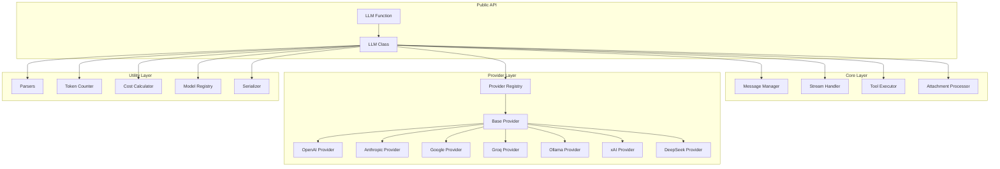
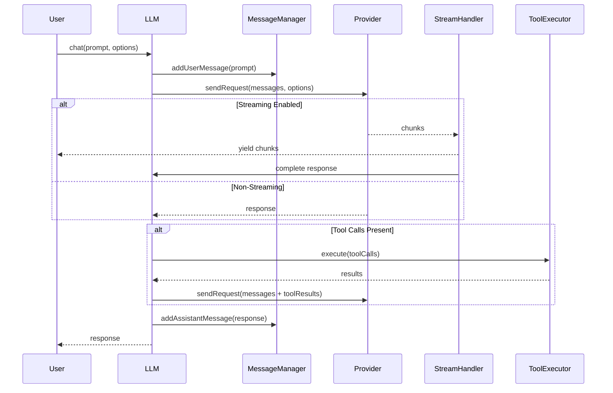

# Design Document: Unified LLM

## Overview

Unified LLM is a TypeScript/JavaScript library providing a unified interface for multiple LLM providers. The library is designed with a modular architecture that separates concerns between core functionality, provider-specific implementations, and utility features. It prioritizes developer experience, type safety, and production reliability while maintaining zero external dependencies.

### Design Goals

1. **Provider Agnostic**: Single API that works identically across all providers
2. **Type Safe**: Full TypeScript support with strict typing
3. **Extensible**: Easy to add custom providers and parsers
4. **Performant**: Efficient streaming, minimal overhead
5. **Testable**: Clean interfaces enabling comprehensive testing
6. **Zero Dependencies**: No external runtime dependencies

## Architecture



### Request Flow



## Components and Interfaces

### Core Types

```typescript
// Message types
interface Message {
  role: 'system' | 'user' | 'assistant' | 'tool';
  content: string | ContentPart[];
  name?: string;
  tool_calls?: ToolCall[];
  tool_call_id?: string;
}

interface ContentPart {
  type: 'text' | 'image_url' | 'image' | 'document';
  text?: string;
  image_url?: { url: string; detail?: 'auto' | 'low' | 'high' };
  source?: { type: 'base64'; media_type: string; data: string };
}

// Tool types
interface Tool {
  name: string;
  description: string;
  parameters: JSONSchema;
  function: (...args: any[]) => any | Promise<any>;
}

interface ToolCall {
  id: string;
  type: 'function';
  function: {
    name: string;
    arguments: string;
  };
}

// Response types
interface ExtendedResponse {
  content: string;
  thinking?: string;
  usage: Usage;
  cost: Cost | null;
  model: string;
  service: string;
  toolCalls?: ToolCall[];
}

interface Usage {
  input_tokens: number;
  output_tokens: number;
  thinking_tokens?: number;
  total_tokens: number;
}

interface Cost {
  input_cost: number;
  output_cost: number;
  thinking_cost?: number;
  total_cost: number;
  currency: 'USD';
}

// Attachment types
interface Attachment {
  type: 'image' | 'document';
  source: 'path' | 'url' | 'base64' | 'buffer';
  data: string | Buffer;
  mimeType?: string;
}

// Options
interface Options {
  service?: ServiceName;
  model?: string;
  apiKey?: string;
  baseUrl?: string;
  temperature?: number;
  max_tokens?: number;
  stream?: boolean;
  extended?: boolean;
  think?: boolean;
  max_thinking_tokens?: number;
  tools?: Tool[];
  parser?: Parser;
  messages?: Message[];
  signal?: AbortSignal;
}

type ServiceName = 'openai' | 'anthropic' | 'google' | 'groq' | 'ollama' | 'xai' | 'deepseek' | string;

// Parser types
type Parser<T = any> = (content: string) => T;
```

### LLM Class

The main class providing the public API:

```typescript
class LLM {
  // Static methods
  static parsers: Parsers;
  static fetchModels(service: ServiceName): Promise<Model[]>;
  static getQualityModels(service: ServiceName): Promise<Model[]>;
  static registerService(name: string, provider: Provider): void;
  static verifyConnection(service: ServiceName, apiKey?: string): Promise<ConnectionStatus>;
  
  // Instance properties
  readonly messages: Message[];
  readonly service: ServiceName;
  readonly model: string;
  
  // Constructor
  constructor(input?: string | Message[], options?: Options);
  
  // Instance methods
  chat(input: string | Message[], options?: Options): Promise<string | ExtendedResponse | AsyncIterable<Chunk>>;
  system(prompt: string): this;
  abort(): void;
  complete(): ExtendedResponse;
  
  // Serialization
  toJSON(): SerializedLLM;
  static fromJSON(json: SerializedLLM): LLM;
}

// Function interface for one-off calls
async function LLM(input: string, options?: Options): Promise<string | ExtendedResponse | AsyncIterable<Chunk>>;
```

### Provider Interface

Base interface all providers must implement:

```typescript
abstract class BaseProvider {
  abstract readonly name: ServiceName;
  abstract readonly supportsThinking: boolean;
  abstract readonly supportsTools: boolean;
  abstract readonly supportsVision: boolean;
  abstract readonly supportsDocuments: boolean;
  
  abstract sendRequest(
    messages: Message[],
    options: ProviderOptions
  ): Promise<ProviderResponse>;
  
  abstract sendStreamingRequest(
    messages: Message[],
    options: ProviderOptions
  ): AsyncIterable<ProviderChunk>;
  
  abstract fetchModels(apiKey?: string): Promise<Model[]>;
  abstract verifyConnection(apiKey?: string): Promise<boolean>;
  
  // Template methods with default implementations
  protected formatMessages(messages: Message[]): any;
  protected formatTools(tools: Tool[]): any;
  protected formatAttachments(attachments: Attachment[]): any;
  protected parseResponse(response: any): ProviderResponse;
  protected parseChunk(chunk: any): ProviderChunk;
}
```

### Provider Registry

Manages provider registration and lookup:

```typescript
class ProviderRegistry {
  private providers: Map<string, BaseProvider>;
  
  register(name: string, provider: BaseProvider): void;
  get(name: ServiceName): BaseProvider;
  has(name: ServiceName): boolean;
  list(): ServiceName[];
}
```

### Message Manager

Handles message history and formatting:

```typescript
class MessageManager {
  private messages: Message[];
  
  constructor(initialMessages?: Message[]);
  
  addSystem(content: string): void;
  addUser(content: string | ContentPart[]): void;
  addAssistant(content: string, toolCalls?: ToolCall[]): void;
  addToolResult(toolCallId: string, result: string): void;
  
  getMessages(): Message[];
  clear(): void;
  
  toJSON(): Message[];
  static fromJSON(messages: Message[]): MessageManager;
}
```

### Stream Handler

Manages streaming responses:

```typescript
class StreamHandler {
  private chunks: Chunk[];
  private complete: boolean;
  private response: ExtendedResponse | null;
  
  async *process(stream: AsyncIterable<ProviderChunk>): AsyncIterable<Chunk>;
  getComplete(): ExtendedResponse;
  isComplete(): boolean;
}

interface Chunk {
  type: 'content' | 'thinking' | 'tool_call' | 'usage';
  content?: string;
  thinking?: string;
  toolCall?: ToolCall;
  usage?: Usage;
}
```

### Tool Executor

Handles tool/function execution:

```typescript
class ToolExecutor {
  constructor(tools: Tool[]);
  
  async execute(toolCalls: ToolCall[]): Promise<ToolResult[]>;
  getToolDefinitions(): ToolDefinition[];
}

interface ToolResult {
  tool_call_id: string;
  result: string;
}
```

### Attachment Processor

Processes file attachments:

```typescript
class AttachmentProcessor {
  static async fromPath(path: string): Promise<Attachment>;
  static fromUrl(url: string): Attachment;
  static fromBase64(data: string, mimeType: string): Attachment;
  static fromBuffer(buffer: Buffer, mimeType: string): Attachment;
  
  static toContentPart(attachment: Attachment, provider: ServiceName): ContentPart;
}
```

### Parsers

Built-in response parsers:

```typescript
const parsers = {
  json: <T = any>(content: string): T => { /* parse JSON */ },
  xml: (content: string): XMLDocument => { /* parse XML */ },
  codeBlock: (content: string, language?: string): string => { /* extract code */ },
  custom: <T>(fn: (content: string) => T): Parser<T> => fn,
};
```

### Model Registry

Manages model information and pricing:

```typescript
class ModelRegistry {
  private models: Map<string, ModelInfo>;
  
  async fetchModels(service: ServiceName, apiKey?: string): Promise<Model[]>;
  getQualityModels(service: ServiceName): Model[];
  getModelInfo(service: ServiceName, model: string): ModelInfo | null;
  addCustomModel(service: ServiceName, model: string, info: ModelInfo): void;
}

interface ModelInfo {
  name: string;
  contextWindow: number;
  inputCostPer1k: number;
  outputCostPer1k: number;
  supportsThinking: boolean;
  supportsTools: boolean;
  supportsVision: boolean;
  supportsDocuments: boolean;
  tags: string[];
}
```

### Cost Calculator

Calculates request costs:

```typescript
class CostCalculator {
  static calculate(usage: Usage, modelInfo: ModelInfo): Cost;
  static isLocal(service: ServiceName): boolean;
}
```

### Serializer

Handles serialization/deserialization:

```typescript
class Serializer {
  static serializeLLM(llm: LLM): SerializedLLM;
  static deserializeLLM(data: SerializedLLM): LLM;
  static serializeMessages(messages: Message[]): string;
  static deserializeMessages(json: string): Message[];
}

interface SerializedLLM {
  service: ServiceName;
  model: string;
  messages: Message[];
  options: Partial<Options>;
}
```

## Data Models

### Message Schema

```typescript
// User message
{
  role: 'user',
  content: 'What is the weather?' // or ContentPart[] for attachments
}

// Assistant message
{
  role: 'assistant',
  content: 'The weather is sunny.',
  tool_calls?: [{ id: 'call_1', type: 'function', function: { name: 'getWeather', arguments: '{}' } }]
}

// System message
{
  role: 'system',
  content: 'You are a helpful assistant.'
}

// Tool result message
{
  role: 'tool',
  tool_call_id: 'call_1',
  content: '{"temperature": 72, "condition": "sunny"}'
}
```

### Extended Response Schema

```typescript
{
  content: 'The weather is 72°F and sunny.',
  thinking: 'Let me check the weather data...', // if thinking enabled
  usage: {
    input_tokens: 15,
    output_tokens: 25,
    thinking_tokens: 50, // if thinking enabled
    total_tokens: 90
  },
  cost: {
    input_cost: 0.00015,
    output_cost: 0.00075,
    thinking_cost: 0.00025,
    total_cost: 0.00115,
    currency: 'USD'
  },
  model: 'gpt-4o',
  service: 'openai',
  toolCalls: [] // if tools were called
}
```

### Serialized LLM Schema

```typescript
{
  service: 'openai',
  model: 'gpt-4o',
  messages: [
    { role: 'system', content: 'You are helpful.' },
    { role: 'user', content: 'Hello' },
    { role: 'assistant', content: 'Hi there!' }
  ],
  options: {
    temperature: 0.7,
    max_tokens: 1000
  }
}
```


## Correctness Properties

*A property is a characteristic or behavior that should hold true across all valid executions of a system-essentially, a formal statement about what the system should do. Properties serve as the bridge between human-readable specifications and machine-verifiable correctness guarantees.*

Based on the acceptance criteria analysis, the following correctness properties must be validated through property-based testing:

### Property 1: Provider Routing Correctness

*For any* supported service name (openai, anthropic, google, groq, ollama, xai, deepseek), when a request is made with that service, the request SHALL be routed to the correct provider implementation.

**Validates: Requirements 2.1, 2.2, 2.3, 2.4, 2.5, 2.6, 2.7**

### Property 2: Message History Invariant

*For any* sequence of chat operations (system, chat, tool results), the messages property SHALL always reflect the correct cumulative history with proper message structure and ordering.

**Validates: Requirements 3.1, 3.2, 3.3, 3.4, 3.5**

### Property 3: Streaming Completion Consistency

*For any* streaming request with extended option enabled, after the stream completes, the complete() method SHALL return an ExtendedResponse containing the full concatenated content, accurate token usage, and calculated cost.

**Validates: Requirements 4.3, 4.4, 9.4**

### Property 4: Tool Execution Correctness

*For any* tool call requested by an LLM, the tool's function SHALL be executed with the exact arguments provided, and the result SHALL be added to message history with the correct tool_call_id.

**Validates: Requirements 6.2, 6.3, 6.6**

### Property 5: Multiple Tool Calls Handling

*For any* number N of tool calls in a single response, all N tools SHALL be executed and all N results SHALL be returned to the LLM in the correct order.

**Validates: Requirements 6.4**

### Property 6: Attachment Processing Correctness

*For any* attachment source type (path, url, base64, buffer), the attachment SHALL be processed into the correct format for the target provider without data loss or corruption.

**Validates: Requirements 7.1, 7.2, 7.3, 7.4, 7.5**

### Property 7: JSON Parser Round-Trip

*For any* valid JSON object, when the LLM returns that JSON as a string and the JSON parser is applied, the parsed result SHALL be deeply equal to the original object.

**Validates: Requirements 8.1**

### Property 8: Code Block Extraction

*For any* markdown string containing code blocks, the codeBlock parser SHALL extract the code content without the fence markers, preserving all whitespace and content within the block.

**Validates: Requirements 8.3**

### Property 9: Token Usage Completeness

*For any* extended response, the usage object SHALL contain input_tokens, output_tokens, and total_tokens fields with non-negative integer values where total_tokens equals input_tokens + output_tokens (+ thinking_tokens if present).

**Validates: Requirements 9.1, 9.2, 9.3**

### Property 10: Cost Calculation Correctness

*For any* extended response with known model pricing, the cost SHALL be calculated as: input_cost = input_tokens * input_price_per_token, output_cost = output_tokens * output_price_per_token, total_cost = input_cost + output_cost (+ thinking_cost if applicable).

**Validates: Requirements 10.1, 10.4**

### Property 11: Local Model Zero Cost

*For any* request to a local service (ollama), the cost SHALL be zero and the response SHALL be marked as local.

**Validates: Requirements 10.2**

### Property 12: Options Passthrough

*For any* option value (temperature, max_tokens, model), the value SHALL be passed to the provider exactly as specified, with request-level options taking precedence over instance-level defaults.

**Validates: Requirements 13.1, 13.2, 13.3, 13.4, 13.5**

### Property 13: Abort Signal Handling

*For any* request with an AbortSignal that is aborted, the request SHALL be cancelled and an AbortError SHALL be thrown, with no further chunks yielded if streaming.

**Validates: Requirements 12.1, 12.2, 12.3, 12.4**

### Property 14: Error Type Correctness

*For any* error condition (rate limit, model not found, validation failure, network error), the appropriate error subclass SHALL be thrown with relevant details (status code, message, retry-after, alternatives).

**Validates: Requirements 17.1, 17.2, 17.3, 17.4, 17.5**

### Property 15: Serialization Round-Trip

*For any* LLM instance with message history and options, serializing to JSON and deserializing back SHALL produce an equivalent instance with identical messages, service, model, and options.

**Validates: Requirements 19.1, 19.2, 19.3**

### Property 16: Custom Service Registration

*For any* custom service registered with a unique name, subsequent requests specifying that name SHALL use the custom service implementation.

**Validates: Requirements 2.8, 15.1, 15.3**

### Property 17: Quality Model Filtering

*For any* service, getQualityModels SHALL return a subset of fetchModels that excludes all models tagged as embeddings, tts, image, audio, or instruct.

**Validates: Requirements 11.2**

### Property 18: Thinking Mode Error Handling

*For any* model that does not support thinking mode, requesting think=true SHALL throw a descriptive error indicating the model does not support reasoning.

**Validates: Requirements 5.5**

### Property 19: Unsupported Attachment Error

*For any* attachment type not supported by the target provider, the request SHALL throw a descriptive error indicating the unsupported attachment type.

**Validates: Requirements 7.8**

### Property 20: Parser Error Handling

*For any* invalid content that cannot be parsed by the specified parser, a parsing error SHALL be thrown containing the original content for debugging.

**Validates: Requirements 8.6**

## Error Handling

### Error Hierarchy

```typescript
class UnifiedLLMError extends Error {
  constructor(message: string, public code: string) {
    super(message);
    this.name = 'UnifiedLLMError';
  }
}

class AuthenticationError extends UnifiedLLMError {
  constructor(message: string, public service: string) {
    super(message, 'AUTH_ERROR');
    this.name = 'AuthenticationError';
  }
}

class RateLimitError extends UnifiedLLMError {
  constructor(
    message: string,
    public retryAfter?: number,
    public service?: string
  ) {
    super(message, 'RATE_LIMIT');
    this.name = 'RateLimitError';
  }
}

class ModelNotFoundError extends UnifiedLLMError {
  constructor(
    message: string,
    public model: string,
    public alternatives?: string[]
  ) {
    super(message, 'MODEL_NOT_FOUND');
    this.name = 'ModelNotFoundError';
  }
}

class ValidationError extends UnifiedLLMError {
  constructor(
    message: string,
    public field: string,
    public value?: any
  ) {
    super(message, 'VALIDATION_ERROR');
    this.name = 'ValidationError';
  }
}

class NetworkError extends UnifiedLLMError {
  constructor(
    message: string,
    public cause?: Error
  ) {
    super(message, 'NETWORK_ERROR');
    this.name = 'NetworkError';
  }
}

class ParsingError extends UnifiedLLMError {
  constructor(
    message: string,
    public originalContent: string,
    public parserType: string
  ) {
    super(message, 'PARSING_ERROR');
    this.name = 'ParsingError';
  }
}

class AbortError extends UnifiedLLMError {
  constructor(message: string = 'Request was aborted') {
    super(message, 'ABORT_ERROR');
    this.name = 'AbortError';
  }
}

class UnsupportedFeatureError extends UnifiedLLMError {
  constructor(
    message: string,
    public feature: string,
    public service: string
  ) {
    super(message, 'UNSUPPORTED_FEATURE');
    this.name = 'UnsupportedFeatureError';
  }
}
```

### Error Handling Strategy

1. **Provider Errors**: Catch provider-specific errors and wrap them in appropriate UnifiedLLMError subclasses
2. **Validation**: Validate all inputs before making requests, throw ValidationError for invalid inputs
3. **Network**: Wrap fetch errors in NetworkError with original cause
4. **Parsing**: Catch parsing failures and throw ParsingError with original content
5. **Abort**: Convert AbortController signals to AbortError

## Testing Strategy

### Testing Framework

The library will use **Vitest** as the testing framework with **fast-check** for property-based testing.

### Unit Testing

Unit tests will cover:
- Individual component functionality (MessageManager, StreamHandler, etc.)
- Parser implementations
- Error class instantiation
- Utility functions

### Property-Based Testing

Each correctness property will be implemented as a property-based test using fast-check:

```typescript
// Example: Property 15 - Serialization Round-Trip
// **Feature: unified-llm, Property 15: Serialization Round-Trip**
test.prop([arbitraryLLMInstance])('serialization round-trip preserves state', (instance) => {
  const serialized = instance.toJSON();
  const deserialized = LLM.fromJSON(serialized);
  
  expect(deserialized.service).toBe(instance.service);
  expect(deserialized.model).toBe(instance.model);
  expect(deserialized.messages).toEqual(instance.messages);
});
```

### Test Organization

```
tests/
├── unit/
│   ├── message-manager.test.ts
│   ├── stream-handler.test.ts
│   ├── tool-executor.test.ts
│   ├── attachment-processor.test.ts
│   ├── parsers.test.ts
│   ├── cost-calculator.test.ts
│   └── errors.test.ts
├── properties/
│   ├── routing.property.test.ts
│   ├── message-history.property.test.ts
│   ├── streaming.property.test.ts
│   ├── tools.property.test.ts
│   ├── attachments.property.test.ts
│   ├── parsers.property.test.ts
│   ├── usage.property.test.ts
│   ├── serialization.property.test.ts
│   └── errors.property.test.ts
├── integration/
│   ├── openai.integration.test.ts
│   ├── anthropic.integration.test.ts
│   └── ollama.integration.test.ts
└── generators/
    ├── message.generator.ts
    ├── options.generator.ts
    ├── tool.generator.ts
    └── attachment.generator.ts
```

### Test Generators

Custom fast-check arbitraries for generating test data:

```typescript
// Message generator
const arbitraryMessage = fc.oneof(
  fc.record({
    role: fc.constant('user' as const),
    content: fc.string({ minLength: 1 })
  }),
  fc.record({
    role: fc.constant('assistant' as const),
    content: fc.string({ minLength: 1 })
  }),
  fc.record({
    role: fc.constant('system' as const),
    content: fc.string({ minLength: 1 })
  })
);

// Options generator
const arbitraryOptions = fc.record({
  temperature: fc.option(fc.float({ min: 0, max: 2 })),
  max_tokens: fc.option(fc.integer({ min: 1, max: 4096 })),
  stream: fc.option(fc.boolean()),
  extended: fc.option(fc.boolean())
});

// Service name generator
const arbitraryServiceName = fc.oneof(
  fc.constant('openai'),
  fc.constant('anthropic'),
  fc.constant('google'),
  fc.constant('groq'),
  fc.constant('ollama'),
  fc.constant('xai'),
  fc.constant('deepseek')
);
```

### Mocking Strategy

For property-based tests that don't require actual LLM calls:
- Use mock providers that return predictable responses
- Mock network layer for error condition testing
- Use in-memory implementations for integration testing

### Test Configuration

```typescript
// vitest.config.ts
export default defineConfig({
  test: {
    globals: true,
    environment: 'node',
    coverage: {
      provider: 'v8',
      reporter: ['text', 'json', 'html'],
      exclude: ['tests/**', '**/*.d.ts']
    }
  }
});

// fast-check configuration
fc.configureGlobal({
  numRuns: 100, // Minimum 100 iterations per property
  verbose: true
});
```
